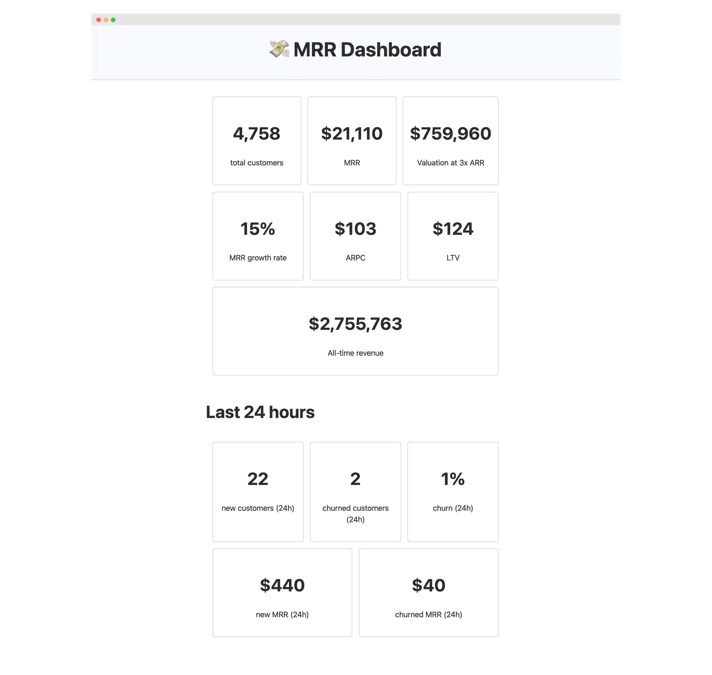

# 💸 `profitable` - SaaS metrics for your Rails app

[](https://badge.fury.io/rb/profitable)

Calculate the MRR, ARR, churn, LTV, ARPU, total revenue & estimated valuation of your `pay`-powered Rails SaaS app, and display them in a simple dashboard.



## Why

[`pay`](https://github.com/pay-rails/pay) is the easiest way of handling payments in your Rails application. Think of `profitable` as the complement to `pay` that calculates business SaaS metrics like MRR, ARR, churn, total revenue & estimated valuation directly within your Rails application.

Usually, you would look into your Stripe Dashboard or query the Stripe API to know your MRR / ARR / churn – but when you're using `pay`, you already have that data available and auto synced to your own database. So we can leverage it to make handy, composable ActiveRecord queries that you can reuse in any part of your Rails app (dashboards, internal pages, reports, status messages, etc.)

Think doing something like: `"Your app is currently at $#{Profitable.mrr} MRR – Estimated to be worth $#{Profitable.valuation_estimate("3x")} at a 3x valuation"`

## Installation

Add this line to your application's Gemfile:
```ruby
gem 'profitable'
```

Then run `bundle install`.

Provided you have a valid [`pay`](https://github.com/pay-rails/pay) installation (`Pay::Customer`, `Pay::Subscription`, `Pay::Charge`, etc.) everything is already set up and you can just start using [`Profitable` methods](#main-profitable-methods) right away.

## Mount the `/profitable` dashboard

`profitable` also provides a simple dashboard to see your main business metrics.

In your `config/routes.rb` file, mount the `profitable` engine:
```ruby
mount Profitable::Engine => '/profitable'
```

It's a good idea to make sure you're adding some sort of authentication to the `/profitable` route to avoid exposing sensitive information:
```ruby
authenticate :user, ->(user) { user.admin? } do
  mount Profitable::Engine => '/profitable'
end
```

You can now navigate to `/profitable` to see your app's business metrics like MRR, ARR, churn, etc.

## Main `Profitable` methods

All methods return numbers that can be converted to a nicely-formatted, human-readable string using the `to_readable` method.

### Revenue metrics

- `Profitable.mrr`: Monthly Recurring Revenue (MRR)
- `Profitable.arr`: Annual Recurring Revenue (ARR)
- `Profitable.all_time_revenue`: Total revenue since launch
- `Profitable.revenue_in_period(in_the_last: 30.days)`: Total revenue (recurring and non-recurring) in the specified period
- `Profitable.recurring_revenue_in_period(in_the_last: 30.days)`: Only recurring revenue in the specified period
- `Profitable.recurring_revenue_percentage(in_the_last: 30.days)`: Percentage of revenue that is recurring in the specified period
- `Profitable.new_mrr(in_the_last: 30.days)`: New MRR added in the specified period
- `Profitable.churned_mrr(in_the_last: 30.days)`: MRR lost due to churn in the specified period
- `Profitable.average_revenue_per_customer`: Average revenue per customer (ARPC)
- `Profitable.lifetime_value`: Estimated customer lifetime value (LTV)
- `Profitable.estimated_valuation(multiplier = "3x")`: Estimated company valuation based on ARR

### Customer metrics

- `Profitable.total_customers`: Total number of customers who have ever made a purchase or had a subscription (current and past)
- `Profitable.total_subscribers`: Total number of customers who have ever had a subscription (active or not)
- `Profitable.active_subscribers`: Number of customers with currently active subscriptions
- `Profitable.new_customers(in_the_last: 30.days)`: Number of new customers added in the specified period
- `Profitable.new_subscribers(in_the_last: 30.days)`: Number of new subscribers added in the specified period
- `Profitable.churned_customers(in_the_last: 30.days)`: Number of customers who churned in the specified period

### Other metrics

- `Profitable.churn(in_the_last: 30.days)`: Churn rate for the specified period
- `Profitable.mrr_growth_rate(in_the_last: 30.days)`: MRR growth rate for the specified period
- `Profitable.time_to_next_mrr_milestone`: Estimated time to reach the next MRR milestone

### Growth metrics

- `Profitable.mrr_growth(in_the_last: 30.days)`: Calculates the absolute MRR growth over the specified period
- `Profitable.mrr_growth_rate(in_the_last: 30.days)`: Calculates the MRR growth rate (as a percentage) over the specified period

### Milestone metrics

- `Profitable.time_to_next_mrr_milestone`: Estimates the time to reach the next MRR milestone

### Usage examples

```ruby
# Get the current MRR
Profitable.mrr.to_readable # => "$1,234"

# Get the number of new customers in the last 60 days
Profitable.new_customers(in_the_last: 60.days).to_readable # => "42"

# Get the churn rate for the last quarter
Profitable.churn(in_the_last: 3.months).to_readable # => "12%"

# You can specify the precision of the output number (no decimals by default)
Profitable.new_mrr(in_the_last: 24.hours).to_readable(2) # => "$123.45"

# Get the estimated valuation at 5x ARR
Profitable.estimated_valuation("5x").to_readable # => "$500,000"

# Get the time to next MRR milestone
Profitable.time_to_next_mrr_milestone.to_readable  # => "26 days left to $10,000 MRR"
```

All time-based methods default to a 30-day period if no time range is specified.

### Numeric values and readable format

Numeric values are returned in the same currency as your `pay` configuration. The `to_readable` method returns a human-readable format:

- Currency values are prefixed with "$" and formatted as currency.
- Percentage values are suffixed with "%" and formatted as percentages.
- Integer values are formatted with thousands separators but without currency symbols.

For more precise calculations, you can access the raw numeric value:
```ruby
# Returns the raw MRR integer value in cents (123456 equals $1.234,56)
Profitable.mrr # => 123456
```

### Notes on specific metrics

- `mrr_growth_rate`: This calculation compares the MRR at the start and end of the specified period. It assumes a linear growth rate over the period, which may not reflect short-term fluctuations. For more accurate results, consider using shorter periods or implementing a more sophisticated growth calculation method if needed.
- `time_to_next_mrr_milestone`: This estimation is based on the current MRR and the recent growth rate. It assumes a constant growth rate, which may not reflect real-world conditions. The calculation may be inaccurate for very new businesses or those with irregular growth patterns.

## Development

After checking out the repo, run `bin/setup` to install dependencies. Then, run `rake spec` to run the tests. You can also run `bin/console` for an interactive prompt that will allow you to experiment.

To install this gem onto your local machine, run `bundle exec rake install`.

## TODO
- [ ] Calculate split by plan / add support for multiple plans (churn by plan, MRR by plan, etc) – not just aggregated
- [ ] Calculate MRR expansion (plan upgrades), contraction (plan downgrades), etc. like Stripe does
- [ ] Add active customers (not just total customers)
- [ ] Add % of change over last period (this period vs last period)
- [ ] Calculate total period revenue vs period recurring revenue (started, but not sure if accurate)
- [ ] Add revenue last month to dashboard (not just past 30d, like previous month)
- [ ] Support other currencies other than USD (convert currencies)
- [ ] Make sure other payment processors other than Stripe work as intended (Paddle, Braintree, etc. – I've never used them)
- [ ] Add a way to input monthly costs (maybe via config file?) so that we can calculate a profit margin %
- [ ] Allow dashboard configuration via config file (which metrics to show, etc.)
- [ ] Return a JSON in the dashboard endpoint with main metrics (for monitoring / downstream consumption)

## Contributing

Bug reports and pull requests are welcome on GitHub at https://github.com/rameerez/profitable. Our code of conduct is: just be nice and make your mom proud of what you do and post online.

## License

The gem is available as open source under the terms of the [MIT License](https://opensource.org/licenses/MIT).
